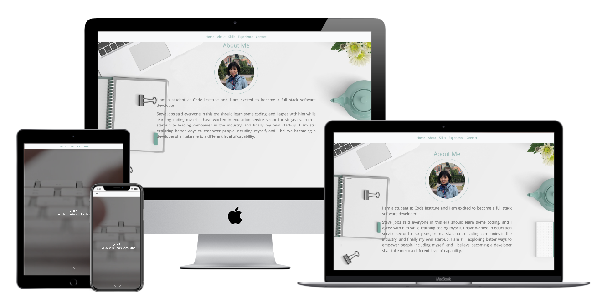

# Milestone Project One by Jing Xu

------------------------------------
## Jing Xu Personal Portfolio Website
This project aims to:
* review and deepen the knowledge and skills I learned in **HTML/CSS Fundamentals** and **User Centric Frontend Development**
* explore a practice to present my knowledge and skills to future employers/co-workers
* explore simplism and aesthetics for users' comfort as much as I can

------------------------------------
## User Experience (UX)
------------------------------------

Researched some of the best practice of personal portfolio websites of 2019, I realised that minimal design and bold visual impact are still the mainstream. These two characteristics shall encourage and welcome the users to explore the information I would like to demonstrate.

### User stories

* As a user, I expect the the information to be well organised and easily navigated, so that I don't have to waste time getting confused; 
* As a user, I want to know the skillset of this developer, so that I can decide whether she is capable for my role/project;
* As a user, I want to know the experience of this developer, so that I can see her passion and interest as well as her potential;

* Design
  * colour
  The two main colours used are a greyish turquoise and white
  * Typography
    * I choose to use the Open Sans font as the main font as it is one of the most widely used fonts, and it suits my website.
  * Imagery
    * Limited by free resource online, I do not have the ideal images to fit the holistic design, and this shall be improved in the future.

## Features

* Responsive on different device sizes
* Parallax scrolling
* Video background

## Technologies Used
#### Languages Used
* HTML5
* CSS3

#### Frameworks, Libraries & Programs Used
1. Bootstrap 5.7 was used throughout the project for styling and responsiveness.
1. Google Fonts were used to import the font into the style.css
1. Font Awesome was used to add icons in the footer.
1. Git was used for version control through Gitpod terminal .
1. GitHub is used to store the projects code.
1. Balsamiq was used to create the wireframes during the design stage.
1. hover.css was used to create hover effect on the icons.

## Testing

The W3C Markup Validator and W3C CSS Validator Services were used to validate every page of the project to ensure there were no syntax errors in the project.

* W3C Markup Validator 
* W3C CSS Validator 

### Further testing

* The Website was tested on Google Chrome, Internet Explorer, Microsoft Edge and Safari browsers.
* The website was viewed on a variety of devices such as Desktop, Laptop, iPhone7, iPhone 8 & iPhoneX.
* A large amount of testing was done to ensure that all pages were linking correctly.
* Friends and family members were asked to review the site and documentation to point out any bugs and/or user experience issues.

### Known Bugs

## Deployment
Since my website was written with Gitpod and stored on GitHub, it is deployed through GitHub Page

## Credits

### Code
* Bootstrap
* Love Running project
* Rosie mini project

### Media
* bg-experience Photo by Indonesia Bertauhid on Unsplash
* bg-contact Photo by Georgie Cobbs on Unsplash
* bg-img by 
* bg-about.jpg Image by <a href="https://pixabay.com/photos/?utm_source=link-attribution&amp;utm_medium=referral&amp;utm_campaign=image&amp;utm_content=1149815">Free-Photos</a> from <a href="https://pixabay.com/?utm_source=link-attribution&amp;utm_medium=referral&amp;utm_campaign=image&amp;utm_content=1149815">Pixabay</a>
* Video by <a href="https://pixabay.com/users/Coverr-Free-Footage-1281706/?utm_source=link-attribution&amp;utm_medium=referral&amp;utm_campaign=image&amp;utm_content=3188">Coverr-Free-Footage</a> from <a href="https://pixabay.com/?utm_source=link-attribution&amp;utm_medium=referral&amp;utm_campaign=image&amp;utm_content=3188">Pixabay</a>

### Acknowledgements

------------------------------------
I modified the website to use parallax scrolling which embraces the users with a lively touch.

 love running project
 https://jacobheflin.com/#about
 bootstrap
 W3schools.com
 Traversy Media youtube tutorial
 

